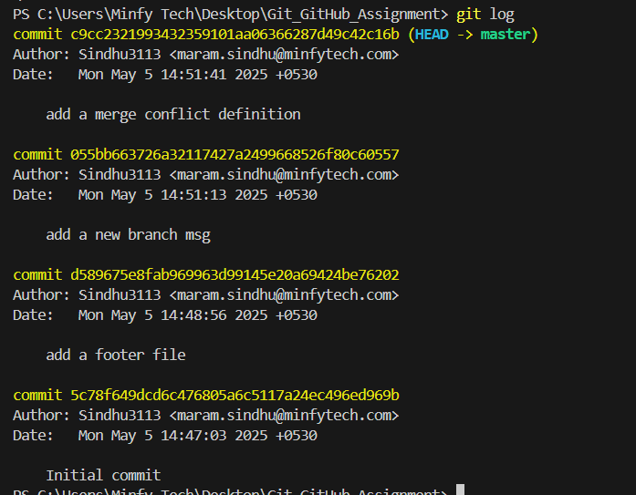
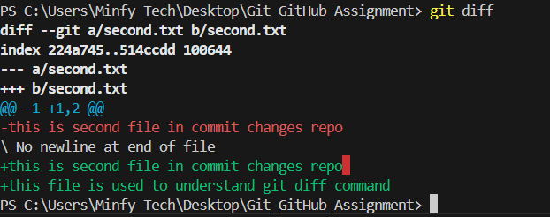

# Commit Changes Explanation #

1. # Initial commit #

 Initial commit was made after entry of basic details 

2. # add a footer file #

 This commit msg was made after entering the text add a footer file

3. # add a new branch msg #

  This commit was made after entering the text add a new branch

4. # add a merge conflict definition #

 This commit was made after entering the text define a merge conflict

 

added a new branch called feature

## pull request img#

